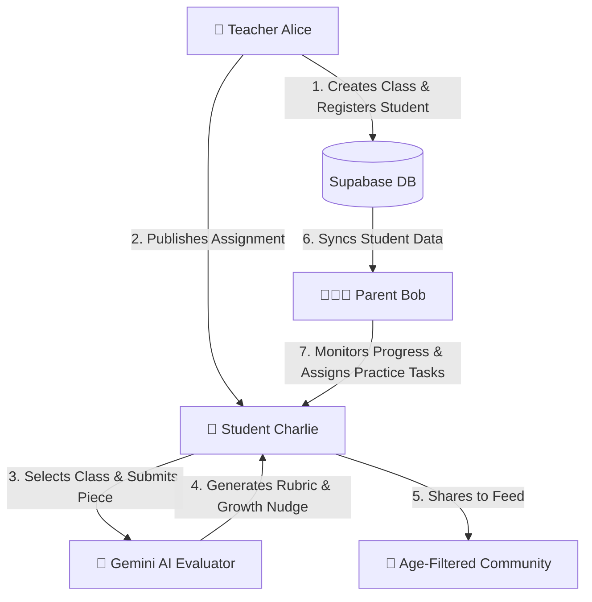

# 📘 Young Writers Platform — User Manual & Flow Guide

Welcome to the **Young Writers Platform**, a safe, judgment-free ecosystem where children (5–17) can write stories, poems, essays, and opinion pieces.

This manual serves as a step-by-step walkthrough of the product flow, guiding you through the experience of a **Teacher**, a **Student (Child)**, and a **Parent**.

---

## 🗺️ Core User Flow Overview



---

## 👥 User Roles & Actions

### 1. 🏫 The Teacher Portal Flow (Alice)
Teachers set up classrooms, register children safely using username-based accounts (protecting minor privacy), assign AI-scaffolded prompts, and review class-wide submissions.

*   **Step 1.1: Authentication & Teacher ID**
    *   Sign up/Log in using the Teacher account.
    *   Teachers can verify their custom identifier (e.g., `TEACH-121` or `TEA-111`) at the top right header.
*   **Step 1.2: Creating a Classroom**
    *   Navigate to the **My Classes** tab on the dashboard.
    *   Create a new class (e.g. `Class 5-A` or `Young Authors Club`).
*   **Step 1.3: Creating a Student Account**
    *   Go to the **Students & Parents** tab.
    *   Fill out the **Register a New Student** form (Name, Username, Password, Age, and Parent's Email).
    *   *Note: This automatically provisions a secure child login and links the parent’s email to this child's record.*
*   **Step 1.4: Creating and Publishing an Assignment**
    *   Click **Create New Assignment** on the dashboard.
    *   **Select Format**: Story, Poem, Essay, or Opinion.
    *   **Scaffolding**: For Essays or Opinions, add commas-separated structural hints (e.g., *Introduction, My Stance, Evidence, Conclusion*) which students will see as outlines in their text editors.
    *   **Inspiration**: Attach curated visual illustrations or upload a custom image.
    *   **Publish**: Set the target age band, assign it to a classroom, and click **Publish to Class**.

---

### 2. 🧒 The Student Workspace Flow (Charlie)
Children write in a distraction-free environment without aggressive grammar/spelling correctors, receive immediate, encouraging AI feedback, and play developmental logic games.

*   **Step 2.1: Logging In**
    *   Log in using the student username account (e.g., `student_charlie`) and password.
*   **Step 2.2: Viewing Assignments**
    *   Navigate to **Assignments** from the top navigation.
    *   Select your classroom from the dropdown list.
    *   *Note: If no teacher is linked to your account, the list will gracefully default to show all active classrooms in the environment.*
*   **Step 2.3: Writing in the Scaffolded Editor**
    *   Select a task and click **Start writing**.
    *   If writing an essay or opinion piece, fill out the scaffolded text boxes (which correspond to the teacher's guidelines) or type freely.
    *   For opinion pieces, you will be prompted to complete a `"See the Other Side"` step—writing 2–3 sentences about what someone who disagrees with your stance might say.
*   **Step 2.4: Submitting & Getting AI Feedback**
    *   Once done, click **Submit**.
    *   The Gemini AI evaluates the piece across **5 Rubric Dimensions** (each rated 1–4):
        1. *Structure & Flow* 📖
        2. *Vocabulary Diversity* 📚
        3. *Creative Spark* 💡
        4. *Prompt Adherence* 🎯
        5. *Author Voice* 🎤
    *   Students see their evaluation scores mapped to encouraging badges (**Starting Out** 🌱, **Building Up** 🌿, **Shining** ✨, or **Superstar** 🌟).
    *   The feedback contains **2–3 positive sentences** highlighting their strengths, accompanied by **one specific Growth Nudge** (e.g., *"One thing to try next time: use sensory details, like sounds or smells, to describe the environment"*).
*   **Step 2.5: Sharing to the Community**
    *   Select your piece from your **Journal** and tap **Share to Community**.
    *   The piece is published to the feed corresponding to your age group (**Early 5–7**, **Middle 8–12**, or **Teen 13–17**) where other students can leave positive reactions (❤️).

---

### 3. 👨‍👩‍👧 The Parent Dashboard Flow (Bob)
Parents oversee their child's writing timeline, monitor progress metrics, reset student passwords, and assign practice tasks to supplement school learning.

*   **Step 3.1: Dashboard Sign-In**
    *   Log in using Google OAuth or email with the parent email address (which must match the email linked to the student profile).
*   **Step 3.2: Reviewing Progress & Skill Breakdown**
    *   View child stats (Total XP, Writing Streaks, and Total Pieces written).
    *   Analyze the **Writing Skill Breakdown**—interactive progress bars showing their child's average scores across the five AI evaluation categories.
    *   Read recent stories, essays, and poems inside the **Recent Pieces & Journal** log.
*   **Step 3.3: Managing Credentials**
    *   If your child forgets their password, click the **Reset Child's PW** button at the top of the Parent Dashboard to immediately update it.
*   **Step 3.4: Assigning Practice Tasks**
    *   Click **Assign Task**.
    *   Enter a title, format (e.g. Story), description, and the custom prompt.
    *   This task immediately appears on your child's **Assignments** inbox under the **Practice Tasks (from Parent)** dropdown option.

---

### 4. 🧠 The Critical Thinking & Creativity Lab
Children can visit the **Lab** tab to build core deduction and viewpoint skills through interactive mini-games:

1.  **Creative Story Catalyst**
    *   *Story Dice*: Roll randomized combos (Character, Location, Conflict) to spark story starters.
    *   *Observation Challenge*: Answer guided queries about a complex visual image to outline characters, settings, and conflicts before writing.
    *   *Book Cover Creator*: Generate AI covers, titles, and summaries for finished stories.
2.  **Logic & Detective Hub**
    *   *Mystery Solver*: Deduction games where kids review case clues and choose deduction paths.
    *   *Logic Grid Puzzles*: Grid-based deduction mapping matrices.
    *   *Story Structure*: Drag-and-drop puzzle to arrange story blocks (*Beginning, Conflict, Climax, Resolution*) chronologically.
    *   *What Happens Next?*: Read half a narrative, submit a prediction, and justify it before reading the actual ending.
3.  **Perspective & Debate Arena**
    *   *Perspective Switch*: Rewrite a standard scene from a different character's perspective (e.g. from the eyes of a pet dog or a strict teacher).
    *   *Argument Arena*: Choose an issue, type your opinion, receive an opposing view generated by AI, and write a rebutting response.
    *   *Spot the Weak Argument*: Spot logical fallacies (false assumptions, emotional arguments) in sentences.

---

## 🛠️ Developer Technical Setup

To build and test the platform locally, follow these instructions:

### 1. Supabase Initialization
Create a Supabase project and run the database configuration scripts in the following order:
*   [supabase_complete_schema.sql](file:///c:/Users/yuvaraj/Desktop/projects/youngwriters/supabase_complete_schema.sql)
*   [supabase_seed_users.sql](file:///c:/Users/yuvaraj/Desktop/projects/youngwriters/supabase_seed_users.sql)
*   [supabase_migration_v4.sql](file:///c:/Users/yuvaraj/Desktop/projects/youngwriters/supabase_migration_v4.sql)

### 2. Add Environment Configuration
Create a `.env` file in the `web/` directory:
```env
VITE_SUPABASE_URL=https://your-project.supabase.co
VITE_SUPABASE_PUBLISHABLE_KEY=your-supabase-anon-key
SUPABASE_SERVICE_ROLE_KEY=your-supabase-service-role-key
VITE_GEMINI_API_KEY=your-gemini-api-key
```

### 3. Local Installation & Run
```bash
cd web
npm install
npm run dev      # Starts React Frontend
npm run server   # Starts Express API Backend
```

---

## 🧪 Testing Sandbox Accounts

Use the password **`password123`** for these sandbox credentials:
*   **Teacher**: `teacher@yw.local`
*   **Parent**: `parent@yw.local` (linked child parent email: `parent@yw.local`)
*   **Student (Child)**: `student_charlie@yw-students.local` (linked to `parent@yw.local`)
